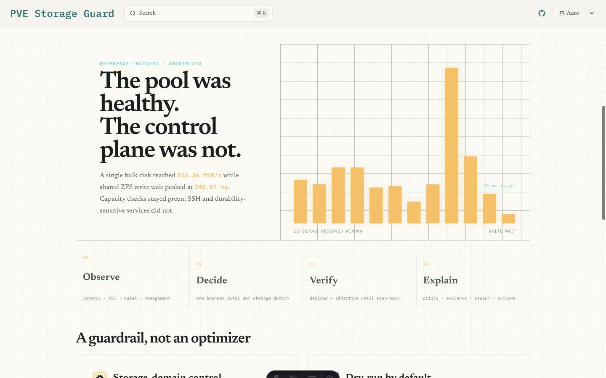
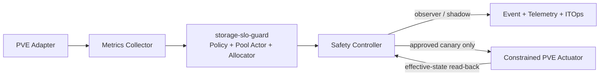

# PVE Storage Guard

**Adaptive I/O protection for Proxmox VE hosts**

PVE Storage Guard protects a Proxmox VE management plane from disk I/O
starvation caused by bulk workloads. It observes storage-domain pressure,
proposes bounded per-disk limits, explains every decision, and can later apply
approved limits through a constrained PVE adapter.

> **Project status: pre-release / observer-only.** The repository is being
> validated with offline replay and local dry-run operation. It does not yet
> authorize production actuation.

PVE Storage Guard is an independent community project. It is not affiliated
with, endorsed by, or sponsored by Proxmox Server Solutions GmbH. Proxmox and
Proxmox VE are trademarks of their respective owners.

## Why this exists

A healthy storage pool can still become an operational single point of failure:
one high-throughput import or backup may drive write latency high enough that
SSH, cluster services, and the PVE management plane become unresponsive. Static
limits help but waste headroom; independent per-VM controllers compete around
the same shared bottleneck.

PVE Storage Guard uses one bounded controller per storage domain and allocates
its budget only to explicitly enrolled disks. The generic policy kernel is
called `storage-slo-guard`; PVE-specific discovery and actuation live behind a
PVE Adapter.



## Safety principles

- Read-only and `dry-run` by default.
- One controller for one shared storage bottleneck.
- Exact disk enrollment; root and critical disks are excluded by default.
- Hard minimum and maximum limits, hysteresis, cooldown, and emergency brake.
- Stale or invalid telemetry can never increase a limit.
- Desired state is verified against effective state before promotion.
- Every proposal is explainable, versioned, and auditable.
- No arbitrary shell execution through the actuator.

## Quick start

Run the offline replay first. It has no SSH, PVE API, database, or actuator
integration:

```sh
python3 -m unittest discover -s poc -p 'test_*.py' -v
python3 poc/simulate.py --format markdown
```

Then exercise the local shadow stream. The command accepts only versioned JSON,
prints a proposal, and always emits `"actuationAllowed": false`:

```sh
OBSERVED_AT=$(date -u +%Y-%m-%dT%H:%M:%SZ)
printf '{"schemaVersion":"guard.storage-slo.io/v1alpha1","id":"quickstart-1","observedAt":"%s","domainKey":"reference-bulk-pool","writeWaitP95Milliseconds":42,"waitValid":true,"emergency":false,"managementPlaneHealthy":true}\n' "$OBSERVED_AT" \
  | go run ./cmd/pve-storage-guard shadow \
      --policy configs/examples/reference-shadow-policy.json \
      --enrollment configs/examples/reference-enrollment.json
```

Decision journaling is explicit and remains local. Add `--journal FILE` to
append a versioned JSONL event before each corresponding proposal reaches
stdout. A new journal is created as `0600`; symlinks, non-regular targets, and
existing files accessible by group or other are rejected. Every successful
append is synced; a non-blocking exclusive lock enforces one writer, and a
256 MiB hard cap stops output until the operator rotates the file. There is no
default journal, built-in rotation, network export, or ITOps delivery.

After the writer is stopped or detached and the file is rotated by an
operator-controlled procedure, verify the sealed file before any later import:

```sh
go run ./cmd/pve-storage-guard journal verify \
  --journal /path/to/sealed-decisions.jsonl
```

The verifier is read-only, refuses an active writer, and emits a versioned
identity-free summary containing the exact raw-file `sha256:` digest. Review
and approve that summary, not a mutable path. An authorized local consumer can
then request bounded pages from the exact sealed content:

```sh
go run ./cmd/pve-storage-guard journal batch \
  --journal /path/to/sealed-decisions.jsonl \
  --expected-digest sha256:APPROVED_DIGEST \
  --offset 0 --limit 64
```

`journal batch` revalidates the whole sealed file and digest before emitting
anything. Its stdout contains private events and must be piped only to an
explicitly authorized local consumer; do not log, publish, or attach it to an
issue. Neither journal command rotates, signs, imports, or delivers data over a
network.

Host service installation instructions will be published only after their
safety gates pass. Until then, see [the goal](docs/GOAL.md),
[architecture](docs/ARCHITECTURE.md), [policy design](docs/POLICY-DESIGN.md),
and [PoC protocol](docs/POC.md).

## Components



The current binary exposes `version`, a non-actuating `shadow` command with an
optional private decision journal, identity-free sealed-journal verification,
and content-addressed bounded local batch reading.
Agent, policy validation, and approved enforcement modes remain roadmap work.
The release workflow uploaded the signed, attested multi-architecture
`v0.1.0-rc.1` image to `ghcr.io/djangoailab/pve-storage-guard`, but the GitHub
package is still private pending an owner visibility checkpoint. Do not assume
anonymous pulls work until the checklist records that change.

## Current replay result

| Scenario | Fixed 20 admission | Selected AIMD admission | Unsafe seconds |
| --- | ---: | ---: | ---: |
| Conservative | 59.26% | 60.11% | 1 vs 1 |
| Nominal | 59.26% | 63.73% | 0 vs 0 |
| Optimistic | 59.26% | 63.88% | 0 vs 0 |

The numbers are counterfactual model estimates, not measured production gains.
The selected AIMD policy remains shadow-only.

## Evidence, not claims

The initial case study is based on a real production incident, with identities,
network details, raw logs, and guest data removed. Historical replay preserves
observed measurements. Counterfactual strategy results are explicitly labeled
as model-assisted estimates and are not presented as measured production gains.

## Documentation

- [Goal and success criteria](docs/GOAL.md)
- [Execution checklist](docs/CHECKLIST.md)
- [Architecture](docs/ARCHITECTURE.md)
- [Policy design](docs/POLICY-DESIGN.md)
- [Offline PoC](docs/POC.md)
- [Replay trace contract](docs/TRACE-CONTRACT.md)
- [Performance evidence](docs/PERFORMANCE.md)
- [Anonymized incident case study](docs/CASE-STUDY.md)
- [Community context and prior art](docs/PRIOR-ART.md)
- [ITOps integration](docs/ITOPS-INTEGRATION.md)
- [Roadmap](docs/ROADMAP.md)
- [Architecture decisions](docs/adr/README.md)

## License

Licensed under Apache-2.0. See [LICENSE](LICENSE). Contributions use the
[Developer Certificate of Origin](DCO.md).
