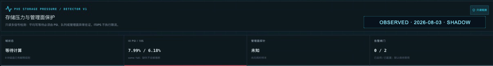

# ITOps integration

## Objective

ITOps provides durable observability, alert evaluation, incident linkage, and
approved task execution. PVE Storage Guard owns storage-control state and
decisions. The PVE probe remains read-only; mutation, if later enabled, uses a
separate structured capability.

## Ownership boundary

| Capability | Owner |
| --- | --- |
| Raw/normalized observations | ITOps observability + PVE collector |
| PVE inventory and disk/storage mapping | PVE Adapter |
| Policy resolution and pool actor | PVE Storage Guard |
| Approval envelope and task handoff | ITOps |
| Structured apply and effective read-back | PVE actuator |
| Decision journal | PVE Storage Guard, linked from ITOps |
| Alerts, incidents, escalation | ITOps |

ITOps does not reproduce the AIMD state machine in its generic threshold engine.
Generic thresholds are stateless sample evaluation; the controller needs durable
cooldown, desired/effective state, leases, and policy versions.

## Metrics contract

Recommended Prometheus-style names (labels are bounded and use opaque IDs):

### Storage and management plane

- `pve_storage_guard_pool_write_wait_seconds{domain,quantile}`
- `pve_storage_guard_pool_iops{domain,operation}`
- `pve_storage_guard_pool_throughput_bytes_per_second{domain,operation}`
- `pve_storage_guard_pool_queue_depth{domain}`
- `pve_storage_guard_io_psi_ratio{node,window}`
- `pve_storage_guard_management_probe_success{node,probe}`
- `pve_storage_guard_management_probe_duration_seconds{node,probe}`
- `pve_storage_guard_disk_throughput_bytes_per_second{domain,resource,operation}`
- `pve_storage_guard_disk_demand_share_ratio{domain,resource}`

### Controller and actuation

- `pve_storage_guard_observation_age_seconds{domain}`
- `pve_storage_guard_controller_up{domain}`
- `pve_storage_guard_controller_lease{domain}`
- `pve_storage_guard_budget_bytes_per_second{domain,state}` where `state` is
  `previous`, `desired`, or `effective`.
- `pve_storage_guard_allocation_bytes_per_second{domain,resource,state}`
- `pve_storage_guard_decisions_total{domain,mode,reason,outcome}`
- `pve_storage_guard_actuation_duration_seconds{domain,outcome}`
- `pve_storage_guard_readback_mismatch{domain,resource}`
- `pve_storage_guard_policy_info{domain,version,mode}` with constant value 1.

Do not use VM names, guest names, paths, task IDs, event IDs, or raw device names
as metric labels. Those belong in structured events to avoid sensitive exposure
and cardinality growth.

## Structured decision event

```json
{
  "schemaVersion": "guard.storage-slo.io/v1alpha1",
  "eventId": "event-0123456789abcdef01234567",
  "eventType": "storage_guard.decision",
  "recordedAt": "2026-08-02T01:02:03Z",
  "domainKey": "opaque-domain-key",
  "mode": "shadow",
  "policyVersion": "opaque-policy-version",
  "observation": {
    "id": "opaque-observation-id",
    "observedAt": "2026-08-02T01:02:01.8Z",
    "ageSeconds": 1.2,
    "writeWaitP95Milliseconds": 42.0,
    "waitValid": true,
    "emergency": false,
    "managementPlaneHealthy": true
  },
  "decision": {
    "proposalId": "proposal-0123456789abcdef01234567",
    "reason": "multiplicative_decrease",
    "previousBudgetMiBps": 20,
    "desiredBudgetMiBps": 10,
    "changed": true,
    "allocations": {"opaque-resource-key": 10},
    "allocationFeasible": true
  },
  "safety": {
    "allocationFeasible": true,
    "actuationAllowed": false,
    "leaseStatus": "not_evaluated",
    "approvalStatus": "not_evaluated",
    "effectiveStateStatus": "not_evaluated"
  },
  "outcome": "shadow_evaluated"
}
```

The public controller now implements this shadow event as an opt-in local JSONL
journal. It validates the event, appends it to a private regular file, syncs the
file, and only then emits the proposal. Journal failure suppresses the matching
proposal. A non-blocking exclusive lock enforces one writer, and a 256 MiB hard
cap fails closed until operator rotation. This is a local handoff, not an ITOps
ingestion route or a production durability claim. Absolute event times and
opaque internal keys make the private journal unsuitable for public release
without a separate sanitization/export review.

Every accepted event is synced before its proposal is emitted, so the journal
path must not share the storage domain being guarded. A slow or failed journal
intentionally stops shadow output. Batching or asynchronous writes would change
that durability boundary and are not enabled implicitly.

### Sealed journal handoff

The audit handoff is intentionally separate from real-time metrics and alerts:

1. Stop or detach the journal writer; do not tail or copy an actively locked
   file.
2. Rotate the closed journal with the site's approved local procedure, keeping
   it private and outside the guarded storage domain.
3. Run `pve-storage-guard journal verify --journal SEALED.jsonl`. The verifier
   takes a shared non-blocking lock, enforces the 256 MiB file and 1 MiB event
   limits, and rejects unsafe files, malformed/unknown fields, forged linkage,
   inconsistent age, and multiple domains.
4. Review the identity-free event, changed, policy-version, duplicate, timestamp
   regression, time-bound, and exact raw-file `sha256:` summary. Non-zero
   anomaly counts are retained for review; the verifier never silently
   deduplicates or sorts.
5. Bind approval to the digest and expected summary, collector target, storage
   domain, policy version, expiry, and exact resource mappings. A file path is
   not an approval identity.
6. Only an approved local consumer may invoke `journal batch` with that digest.
   Each call revalidates the complete sealed file and emits at most 64 private
   events. Never capture its stdout in general task logs.
7. Persist through an idempotent, atomic importer and link its sanitized result
   to the approved task. The public CLI deliberately has no ITOps credentials,
   database access, or network delivery.

Successful verification proves structural consistency and identifies exact
bytes. It is not a signature, tamper-proof provenance, sanitization result,
publication approval, or permission to ingest the private journal.

The internal ITOps draft now implements the matching pure mapper and a
runtime-uninvoked persistence boundary. Given an already-authorized collector target,
expected storage domain, and expected policy revision, the mapper strictly
validates the complete v1alpha1 event, deterministic event/proposal linkage,
timestamp-derived age, non-actuating safety state, stable reason vocabulary,
bounded budgets, and at most 1,024 allocations. The import service maps event
storage/disk keys only through reviewed target-scoped internal resource
bindings. Its repository rechecks PVE target ownership and resource kind, then
claims the deterministic audit ID and inserts its `estimated`, low-cardinality
metrics in one SQLite transaction. Identical retries add nothing; a canonical
SHA-256 digest rejects altered bindings, values, semantics, labels, or times.
Calls are bounded to 64 events, 10,000 metrics, and 1 MiB of private audit
details per event. The mapper does not promote the event's p95 field into
durable monitoring evidence.

The merged code also implements, but does not register, the idempotent-write handoff
capability `storage_guard.journal.import.v1`. Its exact-argv reader uses no
shell, credentials, network client, logger, or database. The approved envelope
binds the journal digest and identity-free summary, collector target,
domain/policy expectation, storage and every disk resource, optional review
group, and batch size. Before each audit/metric transaction the repository
rechecks the current proposal, envelope hash, running state, approval, and both
expiry bounds. Task evidence receives only digest/count reconciliation.
If an optional alert correlation group is present, the same transaction also
requires that the reviewed group already exists. Historical import never
creates or mutates an alert, correlation group, or incident.

A local cross-repository PoC built this Go binary, wrote one synthetic private
shadow event, verified its digest, and passed the exact file/digest to the
compiled ITOps reader. The identity-free result confirmed digest match, one
event, and complete pagination; event content was not printed and the temporary
artifacts were moved to the system Trash.

This remains storage plumbing, not a live ingestion path. The public batch
reader has no transport or persistence. The internal persistence boundary has
no approved capability registration, route, scheduler, alert evaluation,
incident creation, notification, or actuation side effect.

## Alert model

### Informational

- Bulk disk share is high but pool latency and management probes remain healthy.
- Shadow controller proposes a change. Route to dashboard/event stream; no page.

### Warning

Trigger when storage latency breaches the target for two windows **and** at least
one corroborating signal is present: elevated PSI/queue, dominant enrolled disk,
or degraded management probe. Also warn on stale telemetry, lease loss, policy
infeasibility, or repeated shadow churn.

### Critical

Trigger immediately on emergency latency plus management-plane failure/critical
PSI, or on apply/read-back mismatch, rollback failure, conflicting writers, or
continued pressure at minimum budget. Critical response stops new bulk admission
and pages an operator; it does not stop guests automatically.

Use separate clear and hold durations, incident grouping by storage domain, and
reason-aware deduplication. A single throughput spike is not a page.

## Dashboard

One storage-domain view should align:

1. write-wait p50/p95/p99, queue, PSI, IOPS, throughput;
2. management probe success/latency;
3. per-disk demand rate and share;
4. previous/desired/effective budgets and allocations;
5. decisions, policy/mode changes, actuation outcomes;
6. workload task start/end and incident annotations.

The dashboard must label observed measurements separately from modeled replay.

## Runbook

### Diagnose

1. Confirm collector freshness and clock health.
2. Confirm affected storage domain and management probes.
3. Attribute dominant disk demand using the PVE Adapter mapping.
4. Inspect current policy, mode, lease owner, desired/effective state, and recent
   decisions.
5. Determine whether pressure persists at the policy minimum or the reviewed
   storage-domain-specific rollback limit.

### Stabilize

- Observer/shadow: stop or slow new bulk admission through the owning workload
  system; do not mutate PVE from the controller.
- Approved canary: use only the structured exact-resource limit inside the
  approved envelope, then verify effective state.
- On mismatch or drift: restore the last verified state if that restoration was
  pre-authorized, freeze the resource, and escalate.

### Recover and review

Verify management probes and latency remain healthy for a stable window, close
the incident with linked decision events, preserve sanitized derived evidence,
and update policy only through versioned review.

## Rollout

1. Add/retain explicitly typed one-second storage-domain samples and management
   probes; keep durable ITOps cadence separate from controller cadence.
2. Offline replay in CI.
3. Local observer, then shadow with ITOps event ingestion.
4. Alert tuning across quiet and busy periods.
5. Non-critical controlled load and rollback rehearsal.
6. Explicitly approved, expiring one-disk canary.
7. Evidence review before any broader enforcement.

## Current implementation status

The approved production-runtime rehearsal for the internal ITOps online-backup
path completed with only generated data. The wrapper accepted no host or live
volume selector, kept the synthetic WAL writer active during SQLite online
backup, ran every helper without networking or Docker log persistence, and
verified idle I/O plus CPU, memory, PID, read-only-rootfs, and exact capability
boundaries. Its first run exposed a Docker API capability-name representation
difference and failed closed with zero residue; the regression-tested retry
passed in 17 seconds with 512 rows, `quick_check=ok`, zero SQLite sidecars, a
readable archive, and an advancing writer. Independent before/after checks kept
the active service healthy, the application data volume at one writer, both
storage-pressure rules disabled, deployment journals absent, and Docker auth
residue at zero. No live data, alert, notification, journal import, or storage
control state changed. This closes the synthetic backup-runtime gate only; it
does not authorize the still-undeployed successor or alert arming.

The internal ITOps draft PR adds one restricted, read-only operation:
`pve.storage-pressure`. It reads Linux PSI and diskstats pseudo-files and, when
OpenZFS is available, runs the fixed argv `zpool iostat -lpH 1 2`. The first
since-boot row is discarded and only a complete one-second interval row is
mapped. Inactive optional queue fields reported as `-` remain null; required
capacity, I/O, `total_wait`, and `disk_wait` fields fail closed on malformed
data. A missing or failed `zpool` sample degrades that sub-capability without
discarding PSI or diskstats.

Safe diskstats counter deltas derive IOPS, throughput, average wait, queue depth,
and utilization. ZFS pool metrics remain separate gauges named
`zfs.pool.{read,write}.{total_wait,disk_wait}.seconds` plus pool IOPS and
throughput, labeled `statistic=interval_mean` and `intervalSeconds=1`. They are
not relabeled as disk average wait or I/O p95. The PVE REST cluster-status probe
supplies management success and duration. The integration does not expose hardware
identifiers, install the probe, arm alerts, or deploy any service.

ITOps currently permits a minimum fast interval of 10 seconds. This is suitable
for durable monitoring and alert correlation, but not for a one-second control
loop. The local PVE Storage Guard agent must own high-frequency sampling and
downsample observations/events into ITOps; ITOps must not become the actuator or
the source of controller timing.

Diskstats provides cumulative operation and time counters, not a p95 latency.
Average read/write service time is derived from successive deltas. A real p95
still requires an appropriate storage telemetry source and must not be
fabricated from these counters.

The 2026-08-02 read-only baseline demonstrated why the split is necessary. Over
the same short natural-load window, ZFS write `total_wait` reached 153.569 ms as
a one-second interval mean while anonymous member-disk average write wait stayed
at or below 20.100 ms in the three derived intervals; detector v1 remained at
level 0 and all four management probes succeeded. This is not a detector false
negative claim because the layers and statistics differ. ZFS latency is first
being added as shadow calibration telemetry and does not feed detector v1 or a
threshold rule. See the [PoC evidence limits](POC.md#read-only-live-baseline-not-replay-qualified).

The merged integration also contains a pure replay-trace builder for reviewed,
already-authorized metric samples. It emits only relative offsets, numeric
evidence, and coarse storage/workload classes; internal target, resource, node,
and absolute sample-time fields are selection inputs and never become public
trace fields. Its wait semantics are fixed to `average`, aggregation to `none`,
and provenance to `derived`, so a caller cannot relabel diskstats evidence as
`p95`. Its v1alpha2 form preserves a valid storage sample when its matching
management probe is absent and marks the management status `unknown`; the
assessor reports both coverage dimensions and rejects the gap at the production
promotion gate. This builder has no route,
API, file writer, scheduler, or deployment path and therefore does not publish
data by itself.

The builder now indexes only the request-scoped approved metric vocabulary in
one pass instead of rescanning the full sample array for every interval. A
no-rescan regression test and first-match compatibility test pass. Five local
Node.js 22.21.1 runs exported a deterministic 14-day, 60-second fixture (141,120
input metrics and 20,160 output intervals) in 80.472–82.093 ms with identical
output checksums. This times only the pure in-memory builder; it says nothing
about probe/SSH, PVE REST, SQLite, network, dashboard, or real-storage latency.

The v1 detector emits a per-disk level only after wait telemetry exists.
Warning requires target wait plus PSI, queue, or management failure;
critical requires emergency wait plus full PSI or management failure. The
recommended warning/critical rules are seeded disabled. They remain disabled
until the integration is merged and a shadow baseline supports their thresholds.
The persisted SQLite integration test now proves that a two-sample warning
debounce survives evaluator restart and produces one firing followed by one
recovery, with the detector evidence retained. Real notification delivery is
still intentionally disabled.

The dashboard presents ZFS storage-domain interval means in a separate table
from diskstats-derived device averages. It explicitly states that ZFS
`total_wait` is not I/O p95 and does not participate in detector v1. This
prevents visually similar millisecond values from silently sharing thresholds.

Before production checkpoint execution, the integration remained an internal
draft PR and had not been merged or deployed. Verification covered all 1,268
backend tests across 151 files, including the approval-to-persistence SQLite
handoff, exact-argv reader, and deterministic reconciliation tests. TypeScript
build/lint and the
dependency-boundary check also pass locally, as do all 101 frontend tests plus
build/lint. Internal CI run 154 validated capability commit `51cc834`: its Node
22 quality gate passed in 4m31s and dependent linux/amd64 image build passed in
4m47s. Run 155 validated the smaller existing-review-group refinement
`e7e7997`: quality gates passed in 4m34s and the image build in 4m45s. Final
internal run 156
validated the typed ZFS shadow telemetry commit `ccbbabd`: quality gates passed
in 4m33s and the linux/amd64 image build in 5m10s. Production
probe installation, capability registration/runtime invocation, trace export,
notification delivery, and alert enablement remain explicit approval gates.

Rollout-hardening commits `c2ed208` and `db5493b` were validated by final
internal run 158:
Node quality gates passed in 4m33s and the linux/amd64 image build passed in
10m59s after a bounded retry recovered from a transient registry-mirror DNS
timeout. The preceding run 157 failed closed because a shifted synthetic-secret
fixture no longer matched its exact scan fingerprint; the correction preserved
the fixture location rather than broadening the ignore policy.

Replay-export commits `60b8359` and `8104bb2` now emit v1alpha2, preserve valid
wait evidence with missing management status `unknown`, and type diskstats wait
as `block-device`. Final internal
internal run 160
passed the Node quality gate in 4m38s and the linux/amd64 image build in 4m49s.
A cross-repository synthetic check passed the compiled ITOps output through the
public assessor: the complete case reported 100% structural, wait, and
management coverage; omitting one of two management samples reported 50%
management coverage. Both remained ineligible as designed because diskstats
average block-device wait is not storage-domain p95. No event content or
production identity was used or printed.

Follow-up replay-export commit `324422f` replaced repeated caller-array scans
with request-scoped indexes and added the deterministic benchmark described
above. Internal
internal run 161
ran the one-day smoke inside the complete Node quality gate; it passed in 4m34s
and the dependent linux/amd64 image build passed in 4m45s. The PR remained
Draft and no runtime was registered or deployed.

The internal rollout packet separates repository merge, restricted-probe write,
immutable application deployment, alert arming, journal registration, and any
future actuation into independent checkpoints. Initial live acceptance requires
the exact 28 recommended-rule set with both storage-pressure rules disabled,
plus fresh PSI/diskstats/management provenance, detector-v1 labels, and typed
ZFS one-second interval semantics. General recommended-rule arming does not
include storage-pressure rules without a second exact opt-in, and an idempotent
rollback path disables only those two rules. Deployment acceptance uses bounded,
independent health, rollback, privacy, and notification checks; it has no fixed
24-hour waiting requirement. Alert calibration is a separate read-only evidence
gate over complete cycles, representative regimes, exact detector semantics,
the exact disabled-rule contract, and firing/recovery lifecycles; elapsed time
alone cannot close it. See [ADR-0010](adr/0010-evidence-based-alert-calibration.md).

The first live use of those gates validated the separation. The explicitly
approved restricted-probe checkpoint completed after an exact rollback and
runtime-independent retry, with all nine read-only operations accepted. The
separately approved application checkpoint failed closed during protected
host-state validation and restored the previous source tree and image selector
before any container, database, credential, registry, alert, or notification
change. The review separated an incomplete candidate allowlist from a bounded
pre-existing directory-mode drift; neither was silently repaired inside the
failed window. The successor fix passed internal full quality and isolated image
smoke in runs 201 and 204. The exact non-recursive host-mode repair was later
approved and changed only the affected root directory; descendant metadata was
unchanged and the protected-state validator passed.

The successor was then bound to an immutable source archive, release tool, and
image indexes and received a separate Checkpoint C approval. A fresh preflight
detected one additional predecessor restart and stopped before writes; redacted
correlation matched the already-tested SSH lifecycle signature. The source
transaction subsequently preserved protected runtime inodes and retained the
predecessor rollback anchor. The initial image invocation failed registry-auth
preflight before database backup, container stop, or cutover. After interactive
operator authentication, the exact-digest retry completed; the authentication
was removed afterward. The live verifier reported fresh/up collectors, the
exact 28 recommended rules, all existing general rules enabled, all GPU and
storage-pressure rules disabled, supported storage-pressure capability, typed
ZFS and detector evidence, healthy zero-restart candidate containers, absent
deployment journals, and an intact stopped predecessor rollback pair. No
notification expectation was configured, and no alert, journal-registration,
notification, or actuation path was enabled. A second read-only checkpoint
passed with unchanged identity, health, rollback, rule, privacy, and
notification state. The operator explicitly shortened the deployment-only
acceptance window after those two checks. This closes deployment acceptance
with a documented evidence limitation; it is not 24-hour statistical coverage
and does not calibrate or authorize an alert.

A later identity-free, read-only calibration replay evaluated 203 complete
production cycles and 812 disk detector samples. Detector-v1 recomputation had
zero mismatches, and the exact warning/critical rule contract remained disabled.
The gate still rejected alert arming: the window had no quiet cycles, its five
warning samples were isolated rather than two consecutive breaches, and it had
no critical firing/recovery lifecycle. This is the intended outcome: bounded
deployment acceptance can finish while alert, notification, journal, and
actuation paths stay closed until representative evidence exists.

A second read-only replay then evaluated 240 complete cycles and 960 disk
detector samples with zero detector-v1 mismatches. The warning rules would have
completed four firing/recovery lifecycles, while the critical rules completed
none; only one quiet cycle was present. The exact two-rule contract remained
disabled and the gate again rejected arming, now specifically on quiet-regime
and critical-lifecycle coverage. No production pressure was generated to close
those gaps. The identity-free evidence was later merged to the internal fact
source after branch and post-merge quality/image CI passed; that documentation
change did not deploy an image or mutate rules, notifications, data, or control.

The internal read-only v2 evaluator at exact head `1cffa52` was merged as
`cbd6e23` after its exact-head quality and linux/amd64 image run passed. It
grades warning and critical evidence independently without adding an enablement
path. Structural coverage, detector recomputation, the exact
two-rule set, and confirmation that both rules are disabled remain shared
fail-closed gates. Each severity additionally requires its own exact contract,
exposure regime, complete firing/recovery lifecycle, and at least ten baseline
samples for every resource that actually fired. Whole-domain quiet coverage is
retained as a diagnostic because simultaneous quiet across every disk is weaker
evidence than the baseline of the firing resource itself. The conservative
combined result remains the logical AND of warning and critical, and the only
proposed action remains keeping both rules disabled.

The evaluator passed local focused, SQLite read-only, deployment-state,
storage-control, architecture, lint, build, coverage, replay-benchmark, and
staged-tree secret checks. It is merged as diagnostic tooling but not deployed.
ADR-0016 remains Proposed, and merge is not authorization to arm an alert. The
exact evaluator was then streamed to the active backend as stdin without
installation and opened production SQLite read-only/query-only. Its identity-free result
contained 240/240 complete cycles, 960 detector samples, zero mismatches, two
warning-firing resources with adequate individual baselines, and four complete
warning recoveries. Warning review evidence passed. No critical firing or
recovery existed, so critical and combined eligibility remained false. Both
rules stayed disabled and no notification, deployment, or control action
followed. Synthetic critical replay may test software logic but must not be
counted as production evidence, and production pressure must not be generated
to close that gate.

A later identity-free read-only replay expanded the window to 900/900 complete
cycles and 3,600 detector samples. It found 17 quiet, 883 busy, and 352 severe
cycles; level occupancy was 3,458/142/0 for levels 0/1/2, with 140 transitions
and zero detector-v1 mismatches. Both warning-firing resources retained their
required baseline and all 32 warning firings recovered. This closes the quiet
diagnostic and warning lifecycle for the observed window, but not the critical
gate: no level-2 sample, critical firing, or critical recovery existed, so
combined eligibility remained false. The rules remained disabled. An
independent post-check confirmed a healthy active pair, one live-volume writer,
restored terminal echo, and no server-side evaluator file; no database,
deployment, rule, notification, journal, or control state changed.

The transactional database archive was private and verified, but the offline
compression/read-back sequence created an undesirably long maintenance pause.
The internal online-backup implementation now creates a consistent SQLite
backup and copies stable ordinary non-database files while the exact active pair
stays healthy. It keeps archive validation, hashes, method/summary evidence,
recovery journals, and cutover ordering fail-closed. It rechecks free space
after staging against actual logical bytes plus headroom; helper containers are
isolated, resource-bounded, release-labeled, time-bounded, and cleaned only on
an exact current-release match. A stale helper aborts the next deployment for
explicit review.

Container-level rehearsal corrected two defects before merge: streamed Node
helpers now require explicit interactive stdin, and portable Linux idle
`ionice` replaces a cgroup-v2 `io.weight` assumption that was not delegated on
the test host. The backend image build proves the scheduler binary exists. The
final local container run kept a synthetic WAL writer active, verified matching
rows, `quick_check=ok`, sidecar exclusion, opaque-file preservation, archive
readability, effective CPU/memory/PID/idle-I/O limits, forced-stop cleanup, and
zero labeled residue. Exact-head run #244 and post-merge run #245 passed, and
the implementation merged internally as `4f0f052`. This remains the immutable
production candidate; later documentation/tooling images do not replace it.

An additional host-side wrapper then removed operator-composed volume selection
from the production rehearsal. It accepts no live volume or host data path,
creates exactly three run/role-labeled synthetic volumes, disables network and
Docker log persistence, validates the immutable image/revision/helper and
effective runtime limits, and removes only exact name plus run/role-label
matches. A local success run verified a 134,492,160-byte snapshot database,
34,603,008 bytes of separately generated opaque content, a readable
34,949,113-byte archive, 512 matching rows, `quick_check=ok`, zero sidecars, an
active writer, and zero residue. A forced snapshot stop independently left zero
residue. The wrapper merged internally as `ad27888` after exact-head run #248
passed; post-merge run #249 also passed the full quality and linux/amd64 image
gates. Images from the wrapper-only run do not replace candidate `4f0f052`.

The production-host synthetic rehearsal is approved but has not run. It remains
gated on an operator-provided registry credential held only in a root-private
disposable Docker configuration, exact candidate pull, immediate credential-
file removal, and an identity-free result. It cannot deploy the application,
mount the live volume, arm alerts, send notifications, register journals, or
actuate storage. Available event history does not support an exact downtime
calculation, so this project makes no downtime claim.

The merged integration also adds a PVE-only storage-pressure dashboard that combines PSI,
management-probe health, separately typed per-pool and per-disk evidence,
queue depth, utilization, throughput, detector level, and alert-gate state.
The UI labels detector output as evidence rather than a controller decision and
does not expose an actuation action. The following image comes from the real
production shadow baseline, not fixture data. It is a deterministic crop: the
target header and per-pool/per-disk tables were excluded so no target, host,
account, pool, or disk identity is published. The four retained cells show only
detector status, aggregate IO PSI, management-probe state, and alert-gate count.

A later authenticated read-only review found that the currently deployed page
could omit this evidence even while the database contained it: a generic
2,000-series latest-metric query was truncating the named PVE/ZFS series, and a
generic workload throughput metric could be rendered as an unregistered disk.
Internal read/display-only Merged PR #62 at reviewed head `72cb073` adds a bounded
exact-name query (at most 32 names), asks for the 13 storage-panel metrics
explicitly, and accepts only registered `disk` and `zfs_pool` resources for rows
and pressure aggregation.
Focused and full backend/frontend tests, lint, builds, and architecture checks
passed. A production read-only/query-only probe of the exact SQL shape returned
193 current series in 4.378 ms under the 2,000-row bound and confirmed use of
the existing target/name index. Exact PR run #241 passed the full quality and
linux/amd64 image/runtime-smoke gates, and the fix was merged as `bc78477`.
Post-merge main run #242 then passed full quality and published two
digest-bound linux/amd64 images after SBOM, provenance, revision-label, pull,
and runtime-smoke verification. Full private registry coordinates and digests
remain in restricted deployment evidence rather than this public document. The
candidate is undeployed and changes no collector, database schema, rule,
notification, journal, actuator, or control state.

A 2026-08-04 read-only production preflight kept that boundary intact. The
accepted `ecfa810` predecessor still owned both healthy exact containers with
zero restarts; one and only one container mounted the live data volume for
write; no source-replacement, deployment, or rollback journal existed; and the
exact two storage-pressure rules remained disabled. An authenticated read-only
page inspection reproduced the expected old-view failure: generic throughput
resources appeared as duplicate/unregistered disks while registered disk rows
were also present. No collection, setting, rule, notification, database, or
deployment action was invoked.

The first locked-dependency CI run exposed an optional-resource type narrowing
error that the older local dependency tree did not report. The reviewed head
fixes it with an explicit string guard and passed exact-lock full regression.



### Pending dashboard-query correction checkpoint

The read/display correction must not reach production merely because its Draft
or branch CI is green. Its explicit deployment checkpoint remains unapproved
and requires all of the following evidence:

1. The rebased PR head and the resulting internal `main` merge both pass the
   full quality, secret, and linux/amd64 image gates; the candidate is bound by
   immutable commit and image digest.
2. Preflight records the healthy active backend/frontend pair, verifies the
   rollback state and an independently reviewed online backup, and confirms
   that the candidate contains
   no database migration, rule mutation, notification, or actuator change.
3. The approved release mechanism deploys only that immutable candidate. Both
   storage-pressure rules are checked disabled before and after cutover.
4. Authenticated UI/API verification proves that management-probe, PSI, disk,
   and ZFS evidence is present; disk/ZFS rows equal the registered resource
   kinds; no generic workload resource is rendered as an unregistered disk.
5. Any health failure, missing named evidence, resource-classification error,
   enabled storage rule, or release-identity mismatch triggers immediate exact
   rollback to the recorded predecessor and closes the checkpoint as failed.

Alert enablement, notification testing, journal registration, and storage
control are outside this checkpoint and remain separately gated.

Production use of the online-backup implementation remains a separate gate. The
accepted release has an approximately 17.9 GiB live volume, and the older
upgrade path would keep the writer stopped during the full archive. Do not
trade that avoidable outage for a dashboard correction. The replacement path
must prove a consistent SQLite online snapshot, preservation of stable ordinary
files, bounded CPU/memory/process/I/O behavior, capacity headroom, exact helper
cleanup, legacy rollback compatibility, exact candidate images, and an explicit
production approval before it can satisfy item 2.

That implementation later merged as `4f0f052` after exact-head PR run `#244`
and post-merge main run `#245` passed the full quality, secret, and
linux/amd64 image gates. The main run emitted new digest-bound backend and
frontend images for the exact merge. Registry coordinates and digests remain
restricted deployment evidence, and the merge does not itself satisfy the
production capacity, live rehearsal, authenticated acceptance, or explicit
approval gates above.
